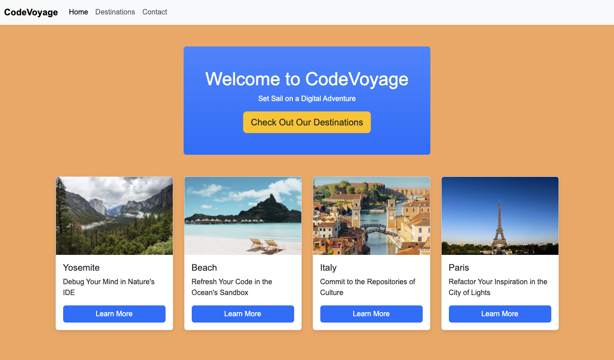

# Building with Bootstrap's Grid System



## Description 📄

In this project, you will learn to build a simple webpage using Bootstrap's Grid System. You will start by setting up the HTML boilerplate, then include the Bootstrap CDN to utilize its grid system. Next, you'll add a responsive navbar, create a grid of cards to display CodeVoyage for our travel Company "CodeVoyage", and finally, add some custom styling.

## Expected Project Structure 🏗️

```
BootstrapTravel/
├── index.html
└── styles.css
```

# Instructions ✅

## 1. **Create the Project Folder and Files**

- [ ] Create a folder named `BootstrapTravel` to store all your project files.
- [ ] Inside the `BootstrapTravel` folder, create a file named `index.html`. This will be your main HTML file.
- [ ] Inside the `BootstrapTravel` folder, create a file named `styles.css`. This file will contain the CSS used to style your HTML content.

## 2. **Start with an HTML Boilerplate**

Now that you have your files set up, start by adding the basic HTML5 boilerplate as seen below to set up the foundation of your document in `index.html`.

```html
<!DOCTYPE html>
<html lang="en">
<head>
  <meta charset="UTF-8">
  <meta name="viewport" content="width=device-width, initial-scale=1.0">
  <title>CodeVoyage</title>
</head>
<body>
  <!-- Your content goes here -->
</body>
</html>
```

**Explanation:**

- Declares the document as HTML5 and sets up the essential metadata and styles.

## 3. **Include the Bootstrap CDN**

To include Bootstrap in your project, add the following CDN link to the `<head>` of your `index.html` file:

```html
<link href="https://cdn.jsdelivr.net/npm/bootstrap@5.3.0/dist/css/bootstrap.min.css" rel="stylesheet">
<link rel="stylesheet" href="styles.css">
```

Your `<head>` section should now look like this:

```html
<head>
  <meta charset="UTF-8">
  <meta name="viewport" content="width=device-width, initial-scale=1.0">
  <title>CodeVoyage</title>
  <link href="https://cdn.jsdelivr.net/npm/bootstrap@5.3.0/dist/css/bootstrap.min.css" rel="stylesheet">
  <link rel="stylesheet" href="styles.css">
</head>
```

**Explanation:**

- The Bootstrap CDN link allows you to use Bootstrap's CSS and components in your project. [Bootstrap CDN Documentation](https://getbootstrap.com/docs/5.3/getting-started/download/)
- It's important to note that the bootstrap versions being utilized by a CDN can change frequently. Be sure to check the documentation for the latest version being utilized.


## 3. **Add a Navbar**

- [ ] In `index.html`, between the `<body>` tags, add the following Bootstrap navbar code:

```html
<nav class="navbar navbar-expand-lg bg-body-tertiary">
  <div class="container-fluid">
    <a class="navbar-brand" href="#">CodeVoyage</a>
    <button class="navbar-toggler" type="button" data-bs-toggle="collapse" data-bs-target="#navbarSupportedContent" aria-controls="navbarSupportedContent" aria-expanded="false" aria-label="Toggle navigation">
      <span class="navbar-toggler-icon"></span>
    </button>
    <div class="collapse navbar-collapse" id="navbarSupportedContent">
      <ul class="navbar-nav me-auto mb-2 mb-lg-0">
        <li class="nav-item">
          <a class="nav-link active" aria-current="page" href="#">Home</a>
        </li>
        <li class="nav-item">
          <a class="nav-link" href="#">Destinations</a>
        </li>
        <li class="nav-item">
          <a class="nav-link" href="#">Contact</a>
        </li>
      </ul>
    </div>
  </div>
</nav>
```

**Explanation:**

- Creates a responsive navigation bar that collapses on smaller screens. [Bootstrap Navbar Documentation](https://getbootstrap.com/docs/5.3/components/navbar/)

## 4. **Add a Hero Section**
- [ ] Below the navbar, add a hero section to introduce the shop:
```html
<div class="container mt-5">
  <div class="jumbotron text-center bg-gradient bg-primary text-white p-5 rounded">
    <h1>Welcome to CodeVoyage</h1>
    <p>Set Sail on a Digital Adventure</p>
    <a class="btn btn-warning btn-lg text-dark" href="#" role="button">Check Out Our Destinations</a>
  </div>
</div>
```

## 4.2. **Create the Grid of Cards**
The grid system is the foundation of layout design in Bootstrap and is based on a 12-column layout.

- [ ] Beneath the hero section, Add the following code to your `index.html`:

```html
<div class="container my-5">
        <div class="row">
      
          <div class="col-md-4 col-sm-6 mb-4">
            <div class="card">
              
              <div class="card-body">
                <h5 class="card-title">Yosemite</h5>
                <p class="card-text">Debug Your Mind in Nature's IDE</p>
                <a href="#" class="btn btn-primary">Learn More</a>
              </div>
            </div>
          </div>
      
          <div class="col-md-4 col-sm-6 mb-4">
            <div class="card">
              
              <div class="card-body">
                <h5 class="card-title">Beach</h5>
                <p class="card-text">Refresh Your Code in the Ocean's Sandbox</p>
                <a href="#" class="btn btn-primary">Learn More</a>
              </div>
            </div>
          </div>
      
          <div class="col-md-4 col-sm-6 mb-4">
            <div class="card">
              
              <div class="card-body">
                <h5 class="card-title">Italy</h5>
                <p class="card-text">Commit to the Repositories of Culture</p>
                <a href="#" class="btn btn-primary">Learn More</a>
              </div>
            </div>
          </div>
      
        </div>
      </div>
```

**Explanation:**

- **Containers**: The container is used to wrap your site’s content and house the grid system. Containers can be either fixed-width or fluid, adapting to the screen size.
- **Rows**: Rows are used to create horizontal groups of columns. Each row must be placed within a container.
- **Columns**: Columns are used to define how content is laid out across the page. Bootstrap's grid allows you to specify how many columns an element should span across different screen sizes.

- `.col-md-4`: This class makes the column take up one-third of the row's width on medium-sized screens (≥768px) and larger. Bootstrap's grid system is based on 12 columns, so col-md-4 spans 4 out of the 12 columns, fitting three columns side by side in a row.

- `.col-sm-6`: This class makes the column take up half of the row's width on small screens (≥576px) and larger. On small screens, two columns will fit side by side, but on medium screens and larger, col-md-4 will take precedence.

- `.mb-4`: This utility class adds a bottom margin of 1.5rem (24px) to the element, creating space between the rows of cards.

- For more details on using Bootstrap cards, refer to the [Bootstrap Card Documentation](https://getbootstrap.com/docs/4.0/layout/grid/).

## 7. **Adjust the Column Width of the Cards**
Now let's explore how we can adjust the number of columns each card spans. You can change the column width by modifying the Bootstrap column classes.

-   [ ]  Modify the column classes in the grid of cards to have each card span 6 columns on medium screens and 12 columns on smaller screens:

```html
<div class="container my-5">
  <div class="row">

    <div class="col-md-6 col-sm-12 mb-4">
      <div class="card">
        
        <div class="card-body">
          <h5 class="card-title">Yosemite</h5>
          <p class="card-text">Debug Your Mind in Nature's IDE</p>
          <a href="#" class="btn btn-primary">Learn More</a>
        </div>
      </div>
    </div>

    <div class="col-md-6 col-sm-12 mb-4">
      <div class="card">
        
        <div class="card-body">
          <h5 class="card-title">Beach</h5>
          <p class="card-text">Refresh Your Code in the Ocean's Sandbox</p>
          <a href="#" class="btn btn-primary">Learn More</a>
        </div>
      </div>
    </div>
    
  </div>
</div>
```
**Explanation:**

-   The `col-md-6` class makes each card take up half the row on medium and larger screens.
-   The `col-sm-12` class makes each card take up the full width of the row on smaller screens.

## 8. **Experiment with Different Column Sizes**
To further understand the flexibility of the Bootstrap grid system, let's experiment with different column sizes.

-   [ ]  Try changing the column classes to `col-md-3` and `col-sm-6`:

```html
<div class="container my-5">
  <div class="row">

    <div class="col-md-3 col-sm-6 mb-4">
      <div class="card">
        
        <div class="card-body">
          <h5 class="card-title">Destination 1</h5>
          <p class="card-text">A beautiful place to visit.</p>
          <a href="#" class="btn btn-primary">Learn More</a>
        </div>
      </div>
    </div>

    <div class="col-md-3 col-sm-6 mb-4">
      <div class="card">
        
        <div class="card-body">
          <h5 class="card-title">Destination 2</h5>
          <p class="card-text">A beautiful place to visit.</p>
          <a href="#" class="btn btn-primary">Learn More</a>
        </div>
      </div>
    </div>

    <div class="col-md-3 col-sm-6 mb-4">
      <div class="card">
        
        <div class="card-body">
          <h5 class="card-title">Destination 3</h5>
          <p class="card-text">A beautiful place to visit.</p>
          <a href="#" class="btn btn-primary">Learn More</a>
        </div>
      </div>
    </div>

    <div class="col-md-3 col-sm-6 mb-4">
      <div class="card">
        
        <div class="card-body">
          <h5 class="card-title">Destination 4</h5>
          <p class="card-text">A beautiful place to visit.</p>
          <a href="#" class="btn btn-primary">Learn More</a>
        </div>
      </div>
    </div>
    
  </div>
</div>
```
**Explanation:**

-   The `col-md-3` class makes each card take up one-quarter of the row on medium and larger screens.
-   The `col-sm-6` class makes each card take up half the row on smaller screens.
-   This setup allows four cards to be displayed side by side on medium and larger screens, while two cards are displayed per row on smaller screens.

## 9. **Add Custom Styling**

You can add custom styles in `styles.css` to override or enhance Bootstrap's default styles. For example:

```css
body {
  font-family: Arial, sans-serif;
  background-color: #f8f9fa;
}

.navbar-brand {
  font-weight: bold;
}

.card {
  box-shadow: 0 4px 8px rgba(0, 0, 0, 0.1);
  transition: transform 0.2s;
}

.card:hover {
  transform: scale(1.05);
}
```

**Explanation:**

- Adds custom styles to modify the appearance of the body, cards, and navbar.

##

**Awesome work! You have successfully built a webpage layout using the CSS box model and display properties.** 

# Conclusion

In this project, you learned how to use Bootstrap to create a responsive and visually appealing webpage. By applying Bootstrap's grid system and components like navbars and cards, you built a well-structured layout.

This hands-on experience with Bootstrap will help you design and develop more advanced web pages in the future.

##

### Solution codebase 👀
🛑 **Only use this as a reference** 🛑

💾 **Not something to copy and paste** 💾

**Note:**  This lab references a solution file located [here](https://github.com/HackerUSA-CE/aisd-wde-4-the-box-model/tree/solution) (link not shown).


---

© All rights reserved to ThriveDX
